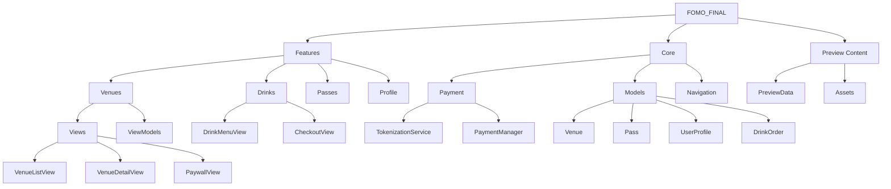
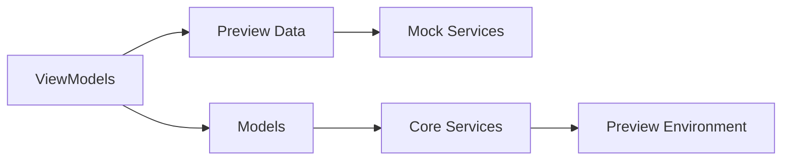
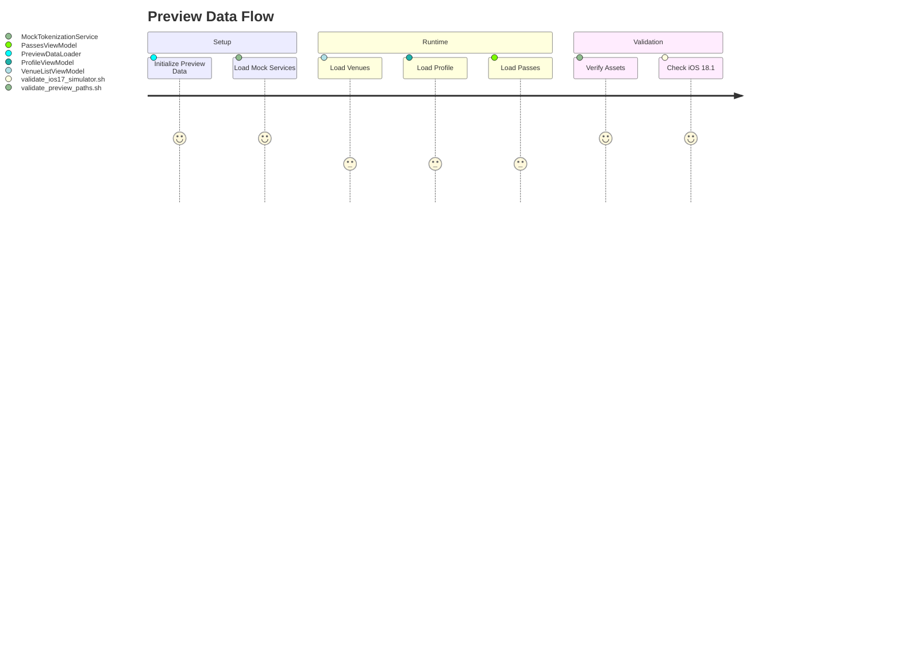
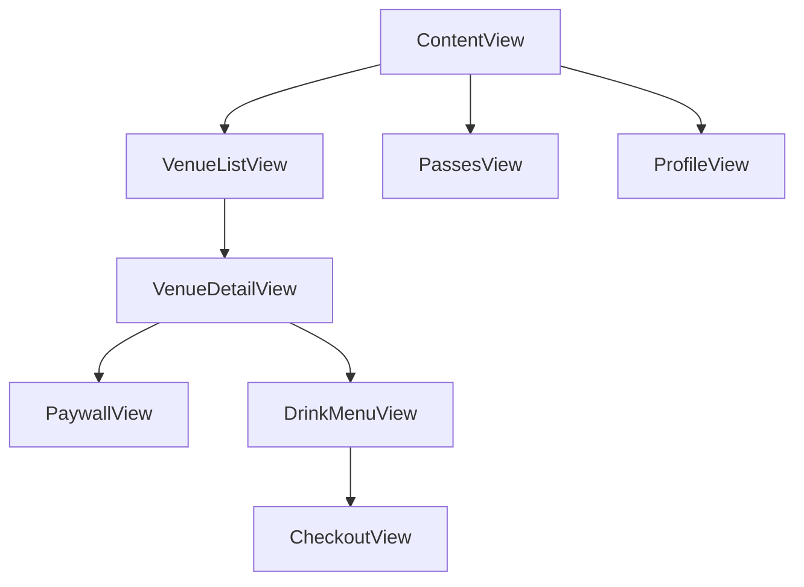
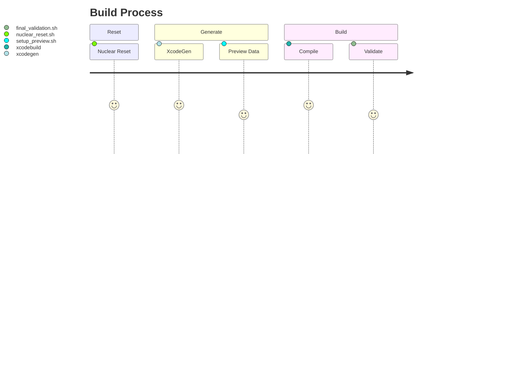

# FOMO iOS Architecture Overview

## Project Structure


## Data Flow


## Preview System


## Feature Dependencies


## Build Pipeline


## Preview Commands
```bash
# Run to refresh preview
cursor docs preview ARCHITECTURE_PREVIEW.md --live

# Validate preview setup
./scripts/validate_preview_paths.sh

# Reset and rebuild
./scripts/nuclear_reset.sh && xcodegen generate
```

## Key Components

### Core Services
- PaymentManager: Handles payment processing and tokenization
- StorageManager: Manages data persistence
- PreviewNavigationCoordinator: Coordinates navigation in preview mode

### Preview Integration
- PreviewDataLoader: Loads mock data for previews
- MockTokenizationService: Simulates payment processing
- Preview environment keys for configuration

### Feature Modules
- Venues: Browse and view venue details
- Passes: Manage digital passes
- Profile: User preferences and settings
- Drinks: Menu browsing and ordering

### Build System
- XcodeGen for project generation
- Validation scripts for preview data
- iOS 18.1 simulator configuration 